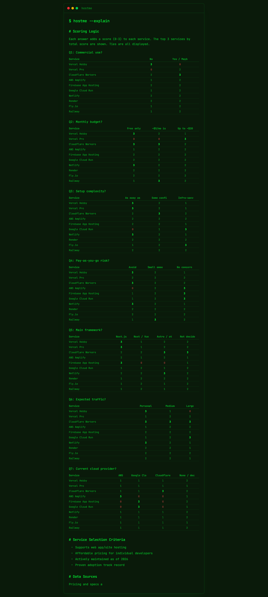

# hostme

Hosting is confusing. This fixes that.

7 questions. 30 seconds. Your top 3 hosting services, scored and explained.

**[Try it live](https://hostme.dev?l=en)** -- takes about 30 seconds.

## What It Does

- Terminal-style UI with typing animations
- 7 questions about your project -- budget, scale, region, framework, etc.
- Scores 10 hosting platforms and ranks your top 3
- Shows why each one fits, what it costs, and how hard it is to migrate
- Share your results on social media with auto-generated preview cards
- Works in English and Japanese

## Why

Every project, same question: where do I deploy this? I kept choosing "whatever I used last time" instead of what actually fits. No comparison, no research -- just vibes.

So I built this.

## How Scoring Works

Each answer adds a weighted score (0--3) per service. Region bonus applied. Top 3 shown with reasoning. Ties at 3rd are all included -- no arbitrary cutoff.

Scoring is fully transparent. [See the logic](https://hostme.dev/about?l=en).

## Supported Services

Picked 10 platforms that indie devs, freelancers, and startups actually choose between. Free tiers, pricing, and specs are kept up to date.

| Service | Type |
|---------|------|
| [Vercel](https://vercel.com/) (Hobby) | Free / Non-commercial |
| [Vercel](https://vercel.com/) (Pro) | Paid |
| [Cloudflare Workers](https://workers.cloudflare.com/) | Free / Commercial OK |
| [AWS Amplify](https://aws.amazon.com/amplify/) | Pay-as-you-go |
| [Firebase App Hosting](https://firebase.google.com/) | Blaze plan (free tier available) |
| [Google Cloud Run](https://cloud.google.com/run) | Free tier available |
| [Netlify](https://www.netlify.com/) | Free / Commercial OK |
| [Render](https://render.com/) | Free tier available |
| [Fly.io](https://fly.io/) | Pay-as-you-go |
| [Railway](https://railway.com/) | Pay-as-you-go ($5 credit/mo) |

## Tech Stack

Next.js (App Router) + TypeScript + Tailwind CSS v4 + framer-motion, deployed on Cloudflare Workers via @opennextjs/cloudflare. OGP images generated at the edge with next/og.

## Contributing

Want to run it locally, fix a bug, or update service pricing? See [CONTRIBUTING.md](CONTRIBUTING.md) for setup, project structure, and the data maintenance guide.

## License

[MIT](LICENSE)

---

## Japanese / 日本語

hostme -- 7つの質問に答えるだけで、最適なホスティング先が見つかるターミナル風Webツール。10サービスからTOP3をスコア付きで提案する。

- ターミナル風UIでサクサク診断
- 予算・規模・リージョン・フレームワークなど7問
- スコアリングは完全公開。なぜその結果になったかも説明する
- 結果はOGP画像付きでシェアできる

**[試してみる](https://hostme.dev?l=ja)** -- 約30秒で終わる。

---

Built by [@shumatsumonobu](https://x.com/shumatsumonobu)
