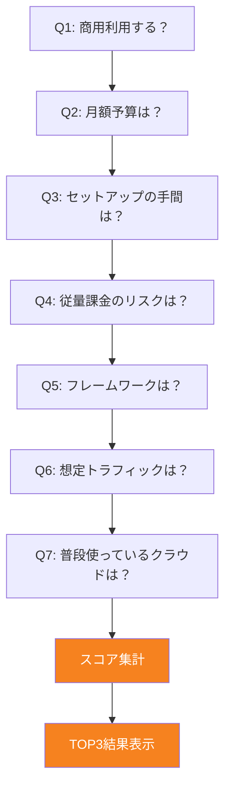
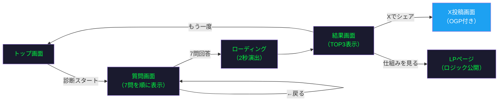

# hostme MVP仕様

## MVP概要

個人開発者・フリーランス向け。質問に答えるだけで最適なホスティング先がわかるWebツール。7問の選択式質問 → スコア付きTOP3結果。静的スコアリングのみ。分岐ロジックはクライアントサイド、OGP画像生成はNode.js runtime（Google Fonts CDN経由でフォント取得）。

## 対象サービス（v1）

### 選定基準

- **モダンホスティング**に限定（従来型の共用サーバー・VPS・レンタルサーバーは対象外）
- **個人開発者・フリーランス・スタートアップ**が現実的に使う選択肢
- 無料枠 or 低コスト（月$20以下）で始められる
- Webアプリ（フロントエンド+API）をデプロイ可能

今後の追加・削除もこの基準に従う。

### サービス一覧

| サービス | タイプ | 備考 |
|---|---|---|
| Vercel Hobby | 無料/非商用 | git pushデプロイ、DX最適化 |
| Vercel Pro | 有料/商用OK | $20/月 |
| Cloudflare Workers | 無料/商用OK | エッジ配信、無料枠が強力 |
| AWS Amplify | 従量課金 | AWS慣れてる人向け |
| Firebase App Hosting | Blazeプラン必須（無料使用枠あり）/商用OK | Next.js/Angular |
| Google Cloud Run | 無料枠あり/商用OK | インフラ知識必要 |
| Netlify | 無料/商用OK（制限あり） | Vercelの対抗馬 |
| Render | 無料枠あり/商用OK | シンプルなPaaS |
| Fly.io | トライアルのみ/商用OK | Dockerベース、エッジ配信（無料枠廃止、7日間トライアルのみ） |
| Railway | 従量課金/商用OK | $5クレジット/月付き |

## 質問フロー

単純な分岐ではなく、回答ごとに各サービスにスコアを加算し、最終的にTOP3を表示する方式。



※ 各質問で分岐はしない。全7問を順に回答し、回答ごとに10サービスへスコアを加算する。

### Q1: 商用利用する？

- しない
- する / するかも

### Q2: 月額予算は？

- 無料がいい
- $5程度ならOK
- $20程度まで出せる

### Q3: セットアップの手間は？

- とにかく簡単がいい（git pushだけで動く）
- 多少の設定は許容
- インフラ得意、Dockerも使える

### Q4: 従量課金のリスクは？

- 絶対避けたい（予測できる料金がいい）
- 少額なら許容
- 気にしない

### Q5: メインで使うフレームワークは？

- Next.js
- Nuxt / Vue
- Astro / その他SSG
- 特に決めていない

### Q6: 想定トラフィックは？

- 個人レベル（月数千PV）
- 中規模（月数万PV）
- 大規模（月10万PV以上）

### Q7: 普段使っているクラウドは？

- AWS
- Google Cloud / Firebase
- Cloudflare
- 特にない / これから選ぶ

### スコアリングロジック

各回答に対して10サービスそれぞれにスコア（0〜3）を加算し、合計スコアの上位3サービスを表示。同点は全て含める。スコアマトリクス・リージョン補正・推奨理由テンプレートの詳細は [spec/scoring.md](spec/scoring.md) を参照。

## 画面設計



### デザイン方針

| 要素 | 方針 |
|------|------|
| スタイル | ターミナル風UI。CLIプロンプト風の質問表示、タイピングアニメーション |
| 配色 | ダーク背景（#1a1a2e）+ グリーン（#00ff41）アクセント。プロンプト記号やハイライトにグリーン |
| フォント | monospace（JetBrains Mono / Fira Code）。質問文は大きめ（20px以上） |
| 選択肢 | 番号選択式（`[1] 無料がいい  [2] $5程度`）。ホバーでグリーンハイライト |
| 遷移 | タイピングアニメーションで次の質問が「打ち出される」演出 |
| プログレス | プロンプト行に `[3/7]` のように表示 |
| レスポンシブ | モバイルファースト。PCでも中央寄せで幅を制限 |
| OGP画像 | `/ogp` および `/lp/ogp` で言語別に自動生成（Node.js runtime） |

### 1. トップ画面

```
$ hostme
> 7つの質問で、あなたに最適なホスティング先が見つかる
> 10サービスからTOP3を提案

[Enter] 診断スタート
```

- ターミナル風のウェルカム画面
- Enterキー or タップで開始

### 2. 質問画面（7問共通レイアウト）

```
[1/7] 商用利用する？

  [1] しない
  [2] する / するかも

> _
```

- プロンプト `>` の後にカーソル点滅
- 番号をタップ or キーボード入力で選択
- 選択後、タイピングアニメーションで次の質問が流れる
- 前の質問・回答はスクロールアップで見える（ターミナルのログのように）
- `← back` コマンドで戻れる

### 3. 結果ローディング画面

```
> analyzing responses...
> comparing 10 services...
> calculating scores...
█████████████████████░░░ 89%
```

- ターミナルのビルドログ風に1行ずつ表示（2秒演出）

### 4. 結果画面

```
✔ Deploy target found!

━━━━━━━━━━━━━━━━━━━━━━━━
  #1  Cloudflare Workers
  → workers.cloudflare.com
━━━━━━━━━━━━━━━━━━━━━━━━
  年間費用    ¥1,500（ドメイン代のみ）
  商用利用    OK
  移行難易度  簡単
  スケール    Paid $5/月〜

  理由: 無料で商用利用OK、帯域無制限、
        git pushだけでデプロイ完了

  #2  Netlify        年間¥0〜
       → www.netlify.com
  #3  Vercel Hobby   年間¥0（非商用のみ）
       → vercel.com

[s] Xでシェア  [r] もう一度  [?] 仕組みを見る
```

- 1位は `Deploy successful!` 風に大きく表示
- 2位・3位はコンパクトに1行ずつ
- コマンド風のアクションボタン

**Xシェア機能**:

シェアテキスト:

```
$ hostme analyze
✔ Deploy target: Cloudflare Workers
  年間¥1,500で商用利用OK、なるほど

→ [サイトURL]
```

OGP画像: 結果ごとに動的生成。レイアウト・技術詳細は「技術設計 > OGP画像レイアウト」を参照。

### 5. LPページ（ロジック公開）

診断の信頼性を担保するための透明性ページ。

- **スコアリングロジック**: 各質問の回答がどのサービスにどうスコア加算されるかの一覧表
- **対象サービスの選定基準**: なぜこの10サービスなのか
- **情報ソース**: 各サービスの料金・仕様の参照元（公式ページへのリンク）
- **メンテナンス方法**: 情報の更新頻度、最終確認日
- **更新履歴**: 料金変更・サービス追加などの変更ログ
- **フィードバック**: 「情報が古い？」「サービスを追加してほしい」→ GitHub Issue

## 技術設計

### 技術スタック

[README.md](../README.md) の「技術スタック」を参照。ホスティング診断ツール自体がCloudflare Workersで動いていることが、結果の説得力にもなる。

### URL設計

```
/                                        → トップ画面（言語選択→リージョン選択→診断開始）
/diagnose?l=ja&r=asia                    → 質問画面（クライアント側でステート管理）
/result?l=ja&r=asia&a=1,2,0,1,3,0,2     → 結果画面（7問の回答インデックスをカンマ区切り）
/about?l=ja                              → LPページ（ロジック公開）
/ogp?l=ja&r=asia&a=1,2,0,1,3,0,2        → OGP画像生成エンドポイント（Node.js runtime）
```

結果URLに回答を含めることで、OGP画像の動的生成とシェアリンクからの結果復元を両立する。

**不正パラメータ処理**: `a` パラメータが不正（桁数不足、範囲外の値、未指定）の場合はトップ画面（`/`）にリダイレクトする。

### OGP画像レイアウト（1200×630px）

```
┌──────────────────────────────────┐
│  $ hostme analyze                │
│                                  │
│  ✔ Deploy target found!          │
│  #1  Cloudflare Workers          │
│  年間¥1,500 / 商用OK             │
│                                  │
│  #2 Netlify  #3 Vercel Hobby     │
└──────────────────────────────────┘
```

背景: ダーク（#1a1a2e）、テキスト: グリーン（#00ff41）。ターミナルウィンドウ風のフレーム付き。

### ドメイン

hostme.dev（Cloudflare Registrarで取得）

### データ管理

`src/data/` 配下に4ファイルで分離管理。データ構造・メンテナンス手順は [README.md](../README.md) の「データメンテナンスガイド」、開発者向け詳細は [CLAUDE.md](../CLAUDE.md) の「データレイヤー」を参照。

- `services.ts` — サービス情報（料金・仕様、日英対応）
- `scoring.ts` — スコアマトリクス + リージョン補正 + 推奨理由テンプレート
- `questions.ts` — 質問定義
- `i18n.ts` — UIテキスト

## メンテナンス設計

サービス情報の鮮度がツールの信頼性に直結するため、AI自動更新パイプラインで運用コストを最小化する。

### 自動情報更新パイプライン

| 項目 | 内容 |
|------|------|
| 実行環境 | GitHub Actions（定期実行: 月1回） |
| 情報取得 | Gemini API（Search Grounding）で各社の料金ページから最新情報を取得 |
| 変更検出 | 現在のJSONデータと取得結果を比較し、差分があればPRを自動作成 |
| 人間の作業 | PRの内容を確認してマージするだけ |

### フロー

1. GitHub Actionsが月1回起動
2. Gemini API（Search Grounding）に各サービスの料金・無料枠・仕様を問い合わせ
3. 現在のJSONと比較し、変更があればブランチを切ってJSONを更新
4. PRを自動作成（変更点のサマリー付き）
5. 人間が確認・マージ → サイトに自動反映

### ハルシネーション対策

- Gemini APIには**要約や説明文を生成させない**。取得するのはURL・タイトル・数値（料金等）のみ
- 取得したURLにHTTPリクエストを送り、**200が返るか確認**。404等の場合は除外
- 最終的にPRを人間が確認してマージ（自動マージしない）

### 保険

- サービスごとに「情報確認日」を表示（自動確認時も更新）
- 「情報が古い？報告する」ボタン → GitHub Issueに飛ばす

## MVPスコープ

### 含む

- 質問フロー（7問）
- 結果表示（スコア付きTOP3+理由+費用+移行難易度+スケール時料金）
- Xシェアボタン+動的OGP
- LPページ（ロジック公開）
- レスポンシブ（モバイルファースト）
- Cloudflare Web Analytics
- 各サービスへのリンク（結果画面）

### 含まない（v2以降）

- AI動的深掘り（追加質問でスコア微調整）
- AI自動情報更新パイプライン（Gemini + GitHub Actions）
- 広告
- さらなるサービス拡充（Deno Deploy, Zeabur等）
- ユーザーアカウント
- 詳細な料金シミュレーション

## 設計項目一覧

| # | 項目 | 優先度 | 状態 |
|---|------|--------|------|
| 1 | 質問フロー・スコアリングロジック | 必須 | 済（spec/scoring.mdで定義） |
| 2 | 対象サービスのデータ定義（10サービス） | 必須 | 済（本ドキュメントで定義） |
| 3 | 画面デザイン（モバイルファースト） | 必須 | 済（本ドキュメントで定義） |
| 4 | OGP画像生成 | 必須 | 済（本ドキュメントで定義） |
| 5 | Cloudflare Workersデプロイ設定 | 必須 | 済（hostme.dev で稼働中） |
| 6 | アナリティクス導入 | 推奨 | 済（Cloudflare Web Analytics） |
| 7 | サービス情報の最終更新日表示 | 推奨 | 済（About画面で表示） |
| 8 | アフィリエイトリンク設置 | 推奨 | 未 |
| 9 | 追加サービス拡充（Deno Deploy等） | 後回し | 未 |
| 10 | アフィリエイトプログラム有無の確認 | 推奨 | 未 |
| 11 | AI自動情報更新パイプライン（Gemini + GitHub Actions） | 後回し | 未 |
| 12 | LPページ（ロジック公開） | 必須 | 済（本ドキュメントで定義） |
| 13 | サービスロゴの商標利用確認 | 推奨 | 未 |
| 14 | URL設計・ルーティング | 必須 | 済（本ドキュメントで定義） |
| 15 | AI動的質問・スコア調整（Gemini API） | 後回し | 未 |
